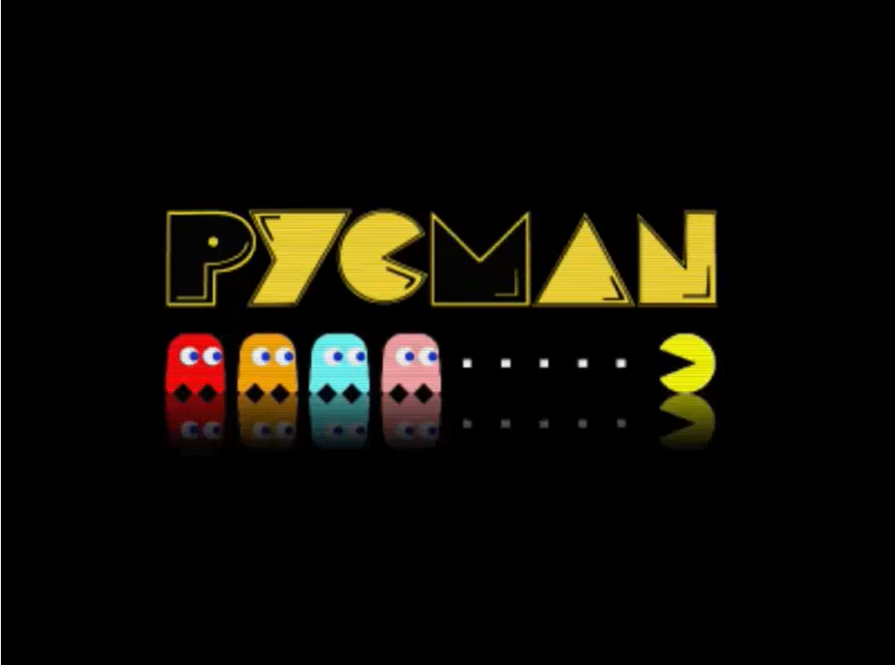
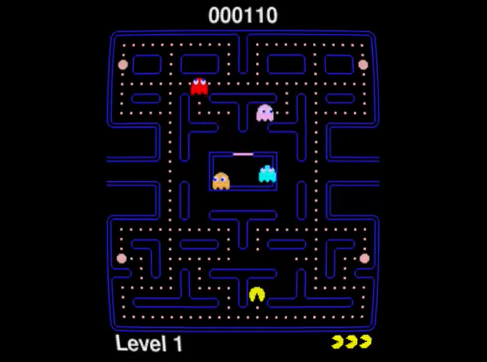
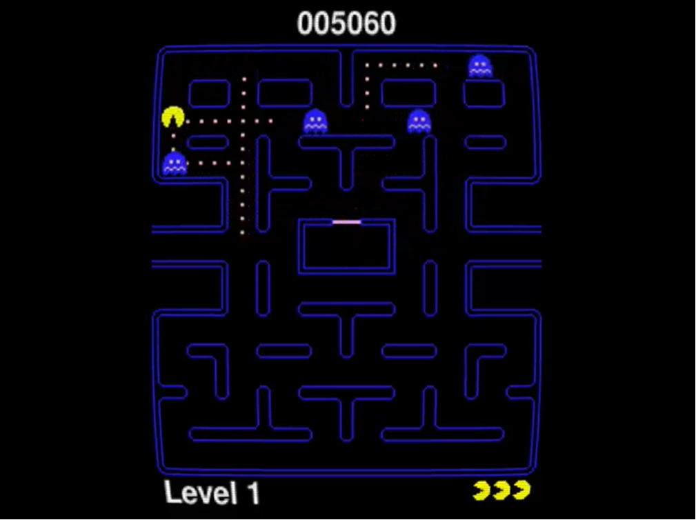

# PycMan
PacMan fan game using PyGame

Clic on the screenshots to see the video

- Arrows Left / Right / Up / Down to move pacman
- ESC to quit the game

To run this game in windows launch build.cmd

The game exe will be located in the /build directory

To run this game in python, first install the prerequisites
- pygame
- pytmx
- moderngl

The game main file is main.py

